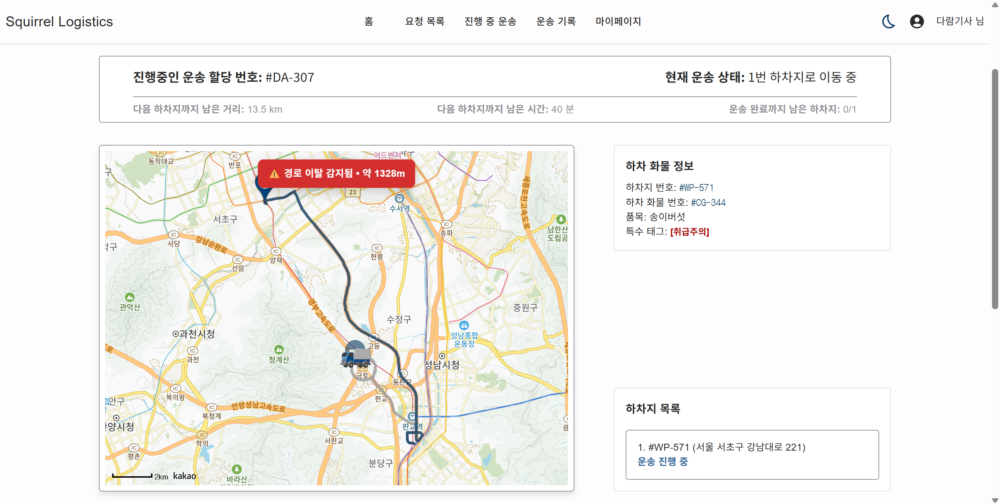
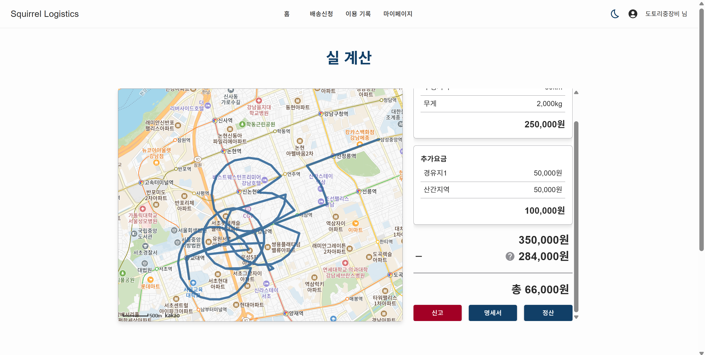
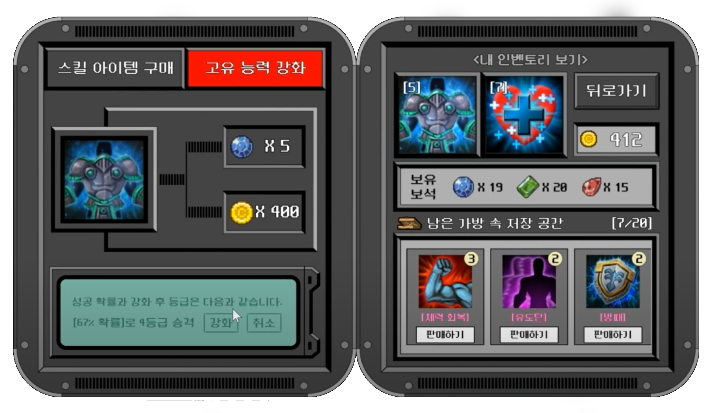
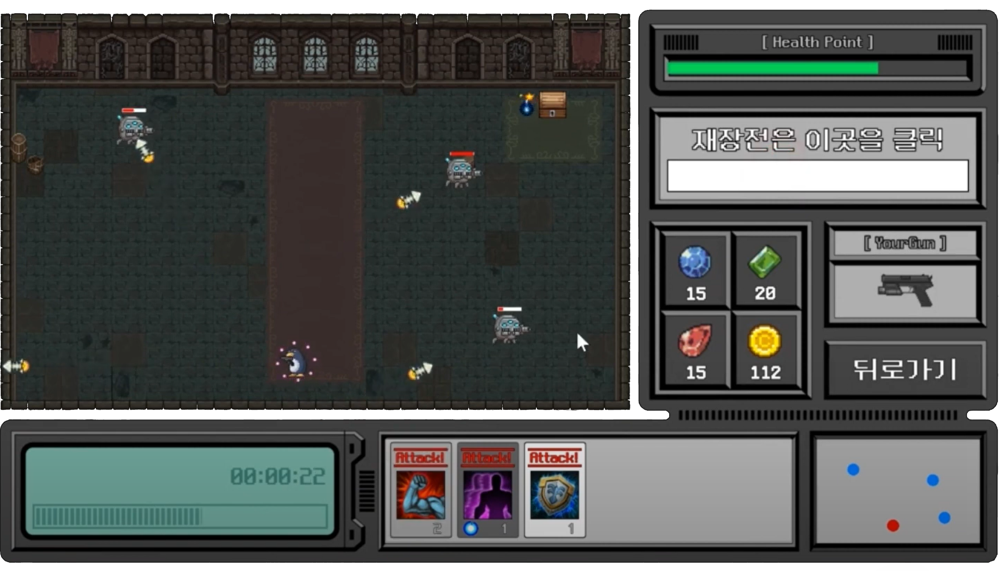
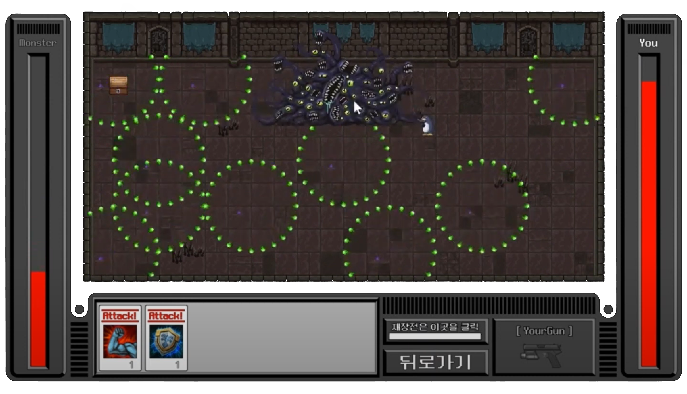

  

  

  <h4 align="center">✨ 제품을 보는 디자이너의 눈과 만드는 개발자의 손을 함께 지닌 풀스택 개발자, 고은설입니다!✨</h4>

사용자와 화면 사이, 팀과 팀 사이를 잇는 <b>실용적 번역가로서</b>, 
<b>디자인 감수성+데이터 이해</b>를 무기로, 오래 버티는 신뢰성 있는 시스템을 설계합니다.  

---

# 🐧 Tech Stack
<h3 align="center"> Languages & DB </h3>

  
  
  
  
  
  
   
  
  
  
  
  
   

<h3 align="center"> Frameworks & Libraries </h3>

  
  
  
  
   
  
  
  
  
  

<h3 align="center"> Infra & DevOps </h3>

  
  
  
  
  
  

<h3 align="center"> Collaboration </h3>

  
  
  
  
   
  
  
  

---

# 📁 Featured Projects

> ### 🐿️ Squirrel Logistics (Team Project)
>
> > 

>   
>   
> 

> 
> - **개요**: 풀스택 물류 매칭 플랫폼 – Driver 모듈 담당
> 
> - **기술 스택**: Spring Boot · React · MySQL · WebSocket · Kakao Map API
> - **담당 기능 및 기여**  
>   - 성능 최적화: AOP 타이머로 엔드포인트 계측 → **목록 10건 7s → 2s**, **상세 12s → 3s**  
>   - Slim DTO 분리, JPQL Projection 단일 조회, 지도 포맷(폴리라인/좌표 배열) 분리  
>   - 실시간: **폴링 → WebSocket/STOMP** 전환, 메시지 페이로드 최소화  
>   - 검증: FSM 더미 드라이버로 경로 이탈/경유지 스킵 시나리오 재현, **300m 임계치 로그 정책** 도입  
>   - 재사용: 경로/지도 모듈 컴포넌트화(다중 경유지, 완료/미완료 구간 표시)
>
> 🔗 [Frondend Deploy][link-squirrel-team] 
> 🔗 [Project Repository][link-squirrel-deploy] 
> 🔗 [Personal Distribution]  (연결 예정)

 

> ### 🕹️ Love Bastards (Solo Launch)
> 
> - **개요**: Unity 기반 스토리 게임 · Google Play **단독 출시**
> 
> - **기술 스택**: Unity · NGUI · Spine · AWS S3 Bucket · GPGS 
> - **담당 업무**  
>   - **배포/운영**: Play Console 번들 등록 및 출시 · **약 3개월 10+회 업데이트**  
>   - **AWS S3 + AssetBundle** 배포 구조 설계/운영 · 구버전 → 신버전 유도 로직  
>   - 사용자 피드백 메일/마켓 리뷰 대응
>   - **툴링**: **Unity 에디터 커스텀 도구**(캐릭터 크기/속도/애니 속도 조정) 제작
> - **성과**: **누적 5만+ 다운로드**
>   
> 🔗 [Google Play Store][link-gameA-play]

 

> ### 👑 Workaholic Knights (Live Ops)
> - **개요**: 런칭 직후 **QA·패치·운영 담당**
>
> - **기술 스택**: Unity · NGUI · Spine · AWS S3 Bucket · GPGS 
> - **담당 업무**  
>   - **업데이트**: 출시 후 **5회 이상** 릴리즈(핫픽스/이벤트/밸런스)  
>   - **품질**: Firebase/크래시 로그 기반 결함 개선, 스토어 패치 릴리즈 관리  
> - **성과**: **누적 5만+ 다운로드**
>   
> 🔗 [Google Play Store][link-gameB-play]

 

> ### 🎮 Dungeon Shooter (Personal Project)
> 
> 

>   
>   
>   
>   
> 
 
>
> - **개요**: Unity 기반 학습/포트폴리오용 프로젝트
>   
> - **개발 내용**
>   - 플레이어 이동/공격, AI 추적/충돌, 사운드/씬 전환
>   - 코드 리팩토링 및 버그 개선 진행
>
> 🔗 [Project Repository][link-dungeon-git] 
> 🔗 [Youtube Demo Video][link-dungeon-demo]

---

# 📜 Achievements
- 🏅 정보처리기사 (2025)  
- 🏅 SQLD (2025)  
- 🌐 풀스택 웹 서비스 배포 경험 (2025)
- 📱 모바일 앱 2종 출시 (2024)

---

# 📌 Next Steps
- 📘 SQLP 취득 준비 
- ☁️ AWS Certified Developer 도전  
- 📈대용량 트래픽 처리 학습/실습

---

# 📊 GitHub Overview

  
  

---

# 📚 Learning Records
- ✏️ [Coding Test Practice (JAVA)][link-coding-test]  
- 📘 [Algorithms & Data Structures (C)][link-algo]  
- 📝 [Fullstack Study Notes (Notion)][link-fullstack-notes]  
- 🎮 [Game Development Notes (Notion)][link-game-class]

---
# 📫 Contact
✉️ eunseolgo14@gmail.com  
 

  

[link-squirrel-team]: https://github.com/kkkddkkk/squirrelLogistics/tree/dev
[link-squirrel-deploy]: https://squirrellogistics.vercel.app
[link-squirrel-contrib]: https://github.com/eunseolgo14/squirrel-logistics-contrib
[link-gameA-play]: https://play.google.com/store/apps/details?id=com.BRAEVE.lovebastards.google&hl=ko
[link-gameB-play]: https://play.google.com/store/apps/details?id=com.BRAEVE.workaholicknights.google&hl=ko
[link-dungeon-git]: https://github.com/eunseolgo14/dungeon-shooter
[link-dungeon-demo]: https://www.youtube.com/watch?v=yaR13-YVNWY
[link-coding-test]: https://github.com/eunseolgo14/codingtest-practice
[link-algo]: https://github.com/eunseolgo14/algorithms-practice
[link-linkedin]: https://linkedin.com/in/eunseolgo14
[link-notion]: https://notion.so/yourpage
[link-game-class]:https://psychedelic-deposit-53c.notion.site/3c17a7156cb74b1691b54061b8d7d273
[link-fullstack-notes]: https://psychedelic-deposit-53c.notion.site/JAVA-aa71c33d2d7b415086728c98264e35ef?pvs=74

